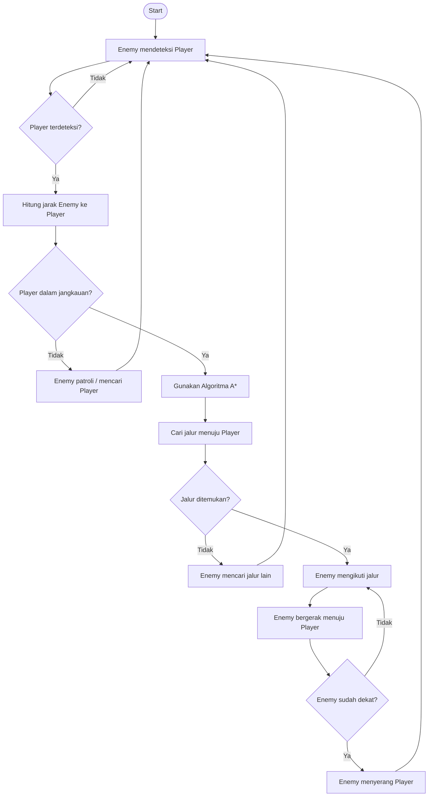

# Enemy AI Pathfinding

**Author:** [FuzailFr](https://github.com/FuzailFr)

## 1. Identifikasi Algoritma

Algoritma yang digunakan adalah **A\* (A-Star Pathfinding)** yang dikombinasikan dengan **Enemy Detection** dan **Distance Checking**.

A\* digunakan untuk mencari jalur dari posisi Enemy menuju Player dengan mempertimbangkan obstacle di dalam dungeon.

## 2. Flowchart Algoritma



## 3. Penjelasan Kode

### 3.1 Fungsi `heuristic(a, b)`

```python
def heuristic(a, b):
    return abs(a[0] - b[0]) + abs(a[1] - b[1])
```

Ini adalah **Manhattan Distance**, digunakan untuk memperkirakan jarak antara dua titik (tanpa diagonal, karena gerakan hanya atas/bawah/kiri/kanan). Fungsi ini dipakai di dua tempat:

- Sebagai **heuristik** dalam algoritma A* (memperkirakan sisa jarak ke goal).
- Sebagai **pengukur jarak** antara Enemy dan Player untuk cek jangkauan deteksi.

### 3.2 Fungsi `a_star(grid, start, goal)`

Ini inti dari pathfinding-nya. Cara kerjanya:

1. **`open_list`** — antrean prioritas (`heapq`) berisi node yang akan dieksplorasi, diurutkan berdasarkan `priority` terkecil (cost + heuristik).
2. **`came_from`** — dictionary untuk mencatat "node ini datang dari node mana", dipakai untuk merekonstruksi jalur di akhir.
3. **`cost`** — menyimpan biaya terkecil yang sudah diketahui untuk mencapai setiap node dari `start`.

**Loop utama:**

- Ambil node dengan prioritas terkecil dari `open_list`.
- Jika node itu adalah `goal`, jalur langsung direkonstruksi dengan menelusuri `came_from` mundur dari goal ke start, lalu dibalik urutannya (`path[::-1]`).
- Jika belum goal, cek 4 tetangga (atas, bawah, kiri, kanan).
- Tetangga yang di luar grid atau berupa obstacle (`grid[nx][ny] == 1`) dilewati.
- Jika jalur ke tetangga itu lebih murah dari yang sudah tercatat sebelumnya, update `cost` dan `came_from`, lalu masukkan ke `open_list` dengan prioritas `new_cost + heuristic`.
- Jika `open_list` habis tanpa menemukan goal, return `None` (jalur tidak ditemukan).

### 3.3 Fungsi `enemy_ai(enemy, player, grid, detection_range)`

Ini adalah logika "otak" musuh, sesuai dengan flowchart:

1. **Hitung jarak** Enemy ke Player pakai `heuristic()`.
2. **Cek jangkauan deteksi**:
   - Jika jarak > `detection_range` → Player dianggap di luar jangkauan, Enemy tetap patroli.
   - Jika dalam jangkauan → Player "terdeteksi", lanjut ke pencarian jalur.
3. **Panggil `a_star()`** untuk mencari jalur dari posisi Enemy ke posisi Player, dengan menghindari obstacle di `grid`.
4. **Jika jalur ditemukan** → tampilkan jalur, simulasikan Enemy bergerak langkah demi langkah mengikuti `path`, lalu anggap Enemy sudah sampai ke Player.
5. **Jika jalur tidak ditemukan** → tampilkan pesan bahwa jalur tidak ada (misalnya Player terkurung tembok).

### 3.4 Simulasi pada `dungeon`

```
0 0 0 0 0
0 1 1 1 0
0 0 0 0 0
0 1 0 1 0
0 0 0 0 0
```

Angka `1` adalah tembok/obstacle, `0` adalah jalur yang bisa dilewati.

- `enemy_position = (0, 0)`, `player_position = (4, 4)`.
- `detection_range = 10` → jaraknya (Manhattan) hanya 8, jadi Player pasti "terdeteksi".
- A* akan mencari jalur memutar menghindari baris `1 1 1` di baris ke-2 dan sel `1` di baris ke-4, lalu mencetak setiap langkah pergerakan Enemy menuju Player.

## 4. Kaitan dengan Flowchart

| Bagian Flowchart | Bagian Kode |
|---|---|
| Enemy mendeteksi Player / hitung jarak | `heuristic(enemy, player)` di `enemy_ai()` |
| Player dalam jangkauan? | `if distance > detection_range` |
| Enemy patroli | `print("Enemy melakukan patroli")` |
| Gunakan Algoritma A* / cari jalur | `a_star(grid, enemy, player)` |
| Jalur ditemukan? | `if path:` / `else:` |
| Enemy mengikuti jalur & bergerak | `for position in path: print(...)` |
| Enemy menyerang Player | `print("Enemy sudah Ketemu Player!")` |

## 5. Catatan Kesesuaian Flowchart dengan Kode

Secara konsep besar, flowchart dan kode sudah selaras. Namun ada beberapa penyederhanaan pada kode dibanding flowchart:

- **Perulangan (loop) kembali ke "Enemy mendeteksi Player"**: pada flowchart, alur kembali ke deteksi Player setelah patroli, gagal menemukan jalur, atau setelah menyerang — ini menggambarkan bagaimana `enemy_ai()` akan dipanggil berulang tiap frame/tick dalam sebuah game loop. Pada kode saat ini, `enemy_ai()` hanya dipanggil satu kali (single-run), belum ada `while True` atau game loop nyata.
- **"Enemy mencari jalur lain"**: pada flowchart, jika jalur tidak ditemukan, Enemy mencoba mencari jalur alternatif. Pada kode, jika `a_star()` mengembalikan `None`, program hanya mencetak pesan "Jalur menuju Player tidak ditemukan." tanpa mencoba jalur lain.
- **"Enemy sudah dekat?"**: pada flowchart, ada pengecekan jarak berulang selama Enemy bergerak untuk menentukan kapan mulai menyerang. Pada kode, tidak ada pengecekan jarak per langkah — begitu iterasi `path` selesai, Enemy langsung dianggap sampai dan menyerang Player.

Jadi flowchart merepresentasikan desain AI yang lebih lengkap/ideal, sedangkan kode Python di atas adalah implementasi dasar (versi sederhana) dari konsep tersebut.

## 6. Cara Menjalankan

```bash
python enemy_ai.py
```

Output akan menampilkan status deteksi Player, jalur yang ditemukan A*, dan langkah-langkah pergerakan Enemy menuju Player.
